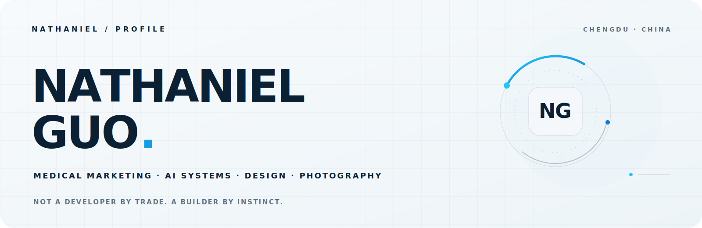

<picture>
  <source media="(prefers-color-scheme: dark)" srcset="./assets/hero-dark.svg">
  <source media="(prefers-color-scheme: light)" srcset="./assets/hero-light.svg">
  
</picture>

  <a href="https://nathaniel-ai-lab.netlify.app/">Website</a> ·
  <a href="https://github.com/Nathanielguo/ai-tongshi">AI Tongshi</a>

## Not a developer by trade. A builder by instinct.

I’m **Nathaniel Guo · 郭兆龙**. I work where **medical technology, marketing, professional education, product thinking and visual storytelling** meet. By day, I turn complex ideas into narratives and experiences people can understand. Beyond work, I turn repeated problems into AI workflows, knowledge systems and small products people can actually use.

我不以代码定义自己。我更擅长发现值得解决的问题，调动市场、设计、内容与 AI，把复杂问题讲清楚，把模糊想法做成可用的东西，把零散经验组织成能够持续生长的系统。

### THINK · MAKE · SHARE

- **THINK** — Connect signals across healthcare, technology, culture and everyday life.
- **MAKE** — Turn ideas into useful products, workflows and visual experiences.
- **SHARE** — Translate complexity into clear stories, education and public knowledge.

## Selected work

**[AI Tongshi · AI 通识](https://github.com/Nathanielguo/ai-tongshi)**  
An end-to-end Chinese AI knowledge system for ordinary readers — from first principles and model mechanics to platforms, applications, risks and the future.

**[Nathaniel AI Lab](https://nathaniel-ai-lab.netlify.app/)**  
A personal AI workspace for turning prompts, agents, reusable skills and automation into practical systems for individuals and small teams.

**[FitCycle](https://github.com/Nathanielguo/FitCycle)**  
A native iOS product that reframes fat loss around sustainable cycles, real health data and everyday adherence — not punishment or short-term numbers.

**[History Overview · 历史纵览](https://github.com/Nathanielguo/Overview-of-history---Zonglan)**  
An AI-powered global history explorer that connects 9 dimensions across 13 world regions — so history becomes a landscape, not a stack of isolated dates.

## Selected chapters

`WORK` **Medical technology marketing** — turning complex information into clear market communication, professional education and product experiences.

`PRACTICE` **AI-native workflows** — bringing prompts, agents, reusable skills and automation into research, knowledge management, content production and project delivery.

`COMMUNITY` **Community and visual practice** — connecting people through photography, creative events, knowledge sharing and visual communication.

`BACKGROUND` **Biomedical Engineering** — trained to connect technology, human needs and real-world application.

## Now

- Building an accessible Chinese knowledge system for understanding AI beyond hype.
- Turning repeated work into reusable AI assets, workflows and operating systems.
- Making independent products at the intersection of health, knowledge and daily life.
- Exploring photography, writing and visual storytelling as tools for clearer thinking.

## Let’s make complexity useful.

I’m open to thoughtful conversations around **medical technology, AI adoption, professional education, content systems and independent products**.

  <a href="https://nathaniel-ai-lab.netlify.app/">Explore the lab ↗</a> ·
  <a href="https://github.com/Nathanielguo/ai-tongshi">Read AI Tongshi ↗</a>

